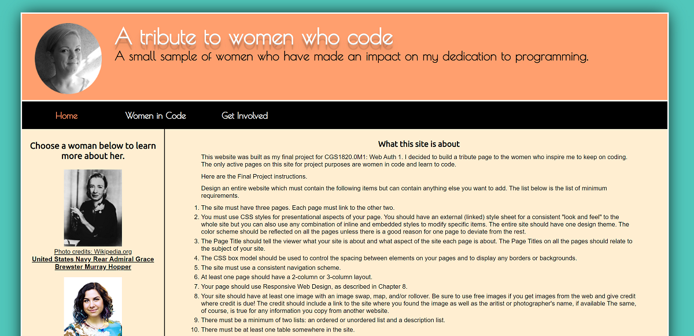

# Women In Code Website
Completed November 2016

## Requirements
This was my final project submission for my HTML design course in college. The premise was to design a website using simple HTML coding and style using CSS. This was a basic website using columns, tables, links, images and the such.

## Thoughts
Since I am now posting this several years after initially creating the project I can't say that I recall having any major issues with the design or implementation of the website. The design was pretty simple since it did not require use of Angular as my later projects did.

